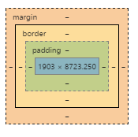

# box model

## 1. 정의
 - 페이지의 모든 엘리먼트는 사각형 박스이다.
 - content / padding / border / margin으로 구성된 것을 칭함

 

## 2. 구성 요소

### 2.1 content
 - 요소의 실제 내용을 포함하는 영역
 - width / height로 구성함
 - width: 
   - default : 100%(가능한 모든 너비를 차지함)
   - inline : content가 차지하는 영역 만큼 자동으로 width값 생성(width 설정 값은 적용 안됨)
   - block : 
     - 값이 지정되어 있지 않으면 default로 지정
     - 값이 지정되어 있으면 지정된 값으로 width 값 생성
 - height : 
   - default : content에 의해 자동으로 height값 생성(auto)
   - inline : 적용되지 않음
   - block 
     - 값이 지정되어 있지 않으면 default로 지정
     - 값이 지정되어 있으면 지정된 값으로 height 값 생성
    
[예제](http://codepen.io/skypentum/pen/dXKkrb?editors=1000)    

### 2.2 padding
 - 엘리먼트의 border 안에 위치함
 - 엘리먼트의 안의 여백을 제공 
 - padding / padding-top / padding-right / padding-bottom / padding-left로 구성
 
 [예제](http://codepen.io/skypentum/pen/XKYzZO?editors=1000)

### 2.3 border 
 - padding과 margin 사이에 위치
 - 엘리먼트 주위의 outline을 제공함
 - border-width 또는 border(width / style / color)로 구성
 
 [예제](http://codepen.io/skypentum/pen/QExOQm?editors=1010)

### 2.4 margin
 - 엘리먼트의 경계선 밖에 위치함
 - 엘리먼트 배치로 쓰임
 - margin / margin-top / margin-right / margin-bottom / margin-left로 구성
 
 [예제](http://codepen.io/skypentum/pen/pbKdxx?editors=1000)

### 2.5 box modeling 시 전체 너비/높이
 - 전체 너비 : margin-right + border-right + padding-right + width + padding-left + border-left + margin-left
 - 전테 높이 : margin-top + border-top + padding-top + height + padding-bottom + border-bottom + margin-bottom 
 
## 3. box modeling 시 고려 사항

### 1) 상대적인 위치
```
<html>
<head>
    <style>
        body div {
            border: 1px solid;    
        }
        
        .relative1 {
          position: relative;
          height: auto;
          margin-top:10px;
        }
        
        .relative4 {
          position: relative;
          display: inline-block;
          width: 400px;
          height: 100px;
        } 
        
        .relative5 {
          position: relative;
          float:left;
          width: 400px;
          height: 100px;
        } 
    </style>
</head>
<body>
    <div class="relative1">
        <div class="relative4">
            div1
        </div>
        <div class="relative4">
            div2
        </div>
    </div>
    
    <div class="relative1">
        <div class="relative5">
            div1
        </div>
        <div class="relative5">
            div2
        </div>
    </div>
</body>
</html>
```
[예제](http://codepen.io/skypentum/pen/NAYvVN?editors=1000)
 
 - display 적용 시 : 내부 DOM이 상대적인 위치로 배치되므로 부모 DOM이 내부 DOM에 설정한 범위를 알 수 있음
 - float 적용 시 : 내부 DOM이 떠있는 상태로 배치되므로 부모 DOM이 내부 DOM에 설정한 범위를 알 수 없음
 - soution : 
    
	1) 빈 element에 clear 속성 설정하여 처리
    
	2) 가상 선택자(:after)를 이용하여 처리

[변경 후 예제](http://codepen.io/skypentum/pen/OXvjZV?editors=1000)

### 2) 절대적인 위치
```
<html>
<head>
    <style>
        body div {
            border: 1px solid;    
        }
        
        .absolute1_1 {
          position: absolute;
          height: auto;
          margin-top:10px;
        }
        
        .absolute1_2 {
          position: absolute;
          height: auto;
          margin-top:10px;
        }
        
        .absolute2_1 {
          position: absolute;
          display: inline-block;
          width: 400px;
          height: 100px;
        }
        
        .absolute2_2 {
          position: absolute;
          display: inline-block;
          width: 400px;
          height: 100px;
        }
        
        .absolute3_1 {
          position: absolute;
          float:left;
          width: 400px;
          height: 100px;
        } 
        
        .absolute3_2 {
          position: absolute;
          float:left;
          width: 400px;
          height: 100px;
        } 
    </style>
</head>
<body>
    <div class="absolute1_1">
        <div class="absolute2_1">
            div1
        </div>
        <div class="absolute2_2">
            div2
        </div>
    </div>
    
    <div class="absolute1_2">
        <div class="absolute3_1">
            div1
        </div>
        <div class="absolute3_2">
            div2
        </div>
        <!--<p class="clear-class"></p>-->
    </div>
</body>
</html>
```
 
 [예제](http://codepen.io/skypentum/pen/pbLAXP?editors=1000)

 - 절대적인 위치로 배치되는 경우 DOM이 상대적인 배치를 완전히 벗어나기 때문에 구조상 앞,뒤 요소에 아무런 영향을 미치지 않음
 - solution : 각 DOM별로 width/height 및 box offset을 통해 구성하여야 함
  
 [변경 후 예제](http://codepen.io/skypentum/pen/xOWLoJ?editors=1000)

## 4. 정리
 - position은 절대적인 위치(absolute/fixed)와 상대적인 위치(relative/)가 있음
 - 이 중 상대적인 위치는 일반적인 흐름과 float 상태로 배치가 가능
 - 절대적인 위치의 경우 float 속성은 none으로 평가가 되며, box offset 속성으로 position함
 - 상대적인 위치의 경우 float 속성 또는 display 속성에 따라 배치되며, float을 초기화 할 경우 clear 속성을 설정함 
 
## 참조 사이트
```
https://developer.mozilla.org/ko/docs/Web/CSS/CSS_Box_Model/Introduction_to_the_CSS_box_model
http://nolboo.kim/blog/2013/07/22/beginners-guide-to-html-and-css-3-slash-10/
```
